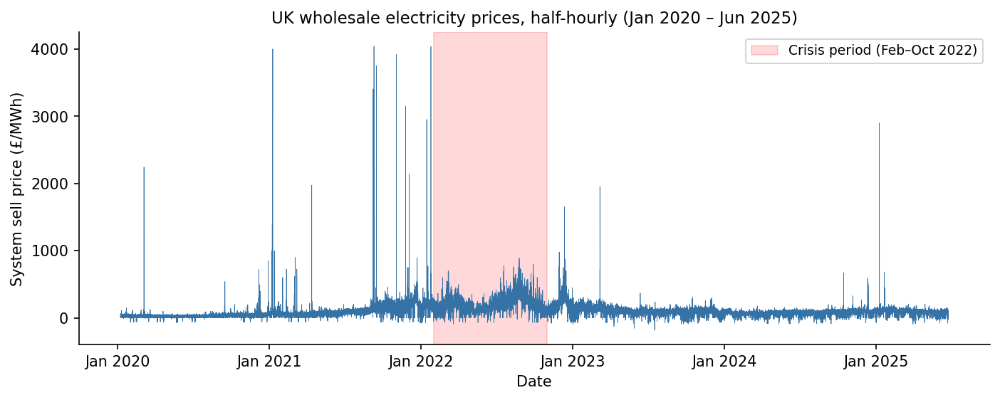
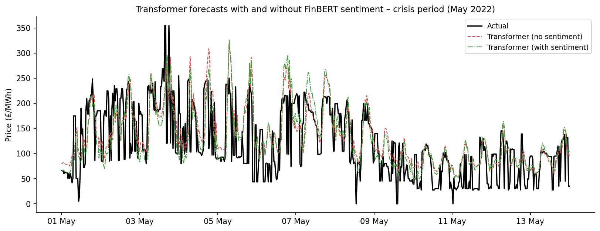
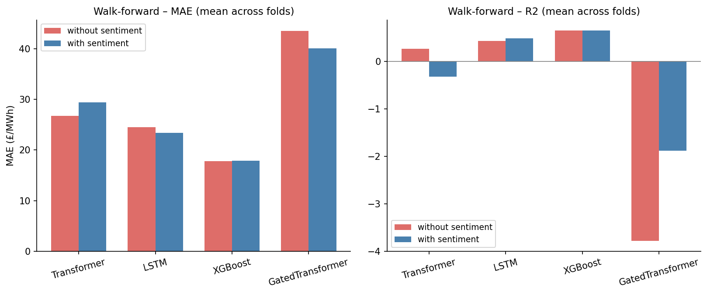
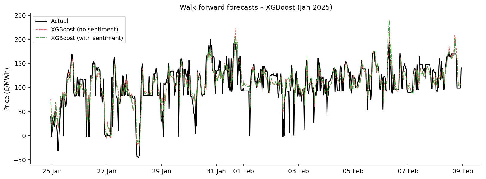
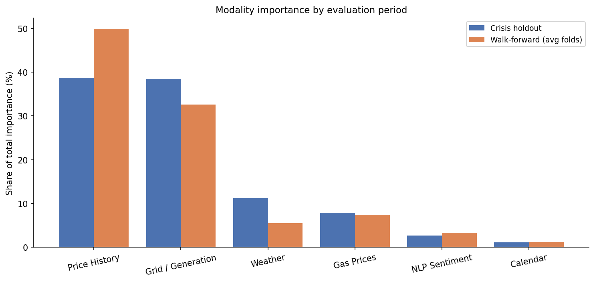

# Multimodal Deep Learning for UK Wholesale Electricity Price Forecasting

[](https://www.python.org/)
[](LICENSE)
[](https://pytorch.org/)
[](https://xgboost.readthedocs.io/)
[](https://huggingface.co/ProsusAI/finbert)

Predict UK wholesale electricity prices by fusing market data, weather, grid conditions and news sentiment. The core research question is whether NLP-derived geopolitical signals add measurable value during volatile market regimes, using the 2022 energy crisis as a natural experiment.

## Highlights

- **Seven public data sources**, six modalities, 96,408 half-hourly samples (Jan 2020 - Jun 2025)
- **Five model architectures** from a statistical baseline to a custom attention-based model
- **FinBERT sentiment pipeline** scoring 8,467 Guardian articles into daily polarity + shock features
- **Two rigorous protocols**: crisis holdout (Feb-Oct 2022) and 5-fold walk-forward (2025 normal conditions)
- **Sentiment helps in crises, not normal conditions**: ~4% crisis MAE improvement, statistically insignificant in normal periods
- **Fully reproducible**: fixed seeds, fixed snapshot dates, public data, no paid keys

## How it works

Seven public data sources feed a unified pipeline. Everything is aligned to a timezone-aware half-hourly grid, missing values are interpolated, and the generation mix is pivoted by fuel type into feature columns.

| What | Where from | Granularity |
|---|---|---|
| Electricity prices (target) | Elexon BMRS | Half-hourly |
| Generation by fuel type | Elexon BMRS | Half-hourly |
| National demand | Elexon BMRS | Half-hourly |
| Solar generation | Sheffield Solar PV Live | Half-hourly |
| Weather (temp, wind, cloud) | Open-Meteo Archive | Hourly |
| Gas prices (TTF futures) | Yahoo Finance | Daily |
| News articles | Guardian API | Per-article |

News articles pass through FinBERT (ProsusAI), a BERT model pre-trained on financial corpora, producing daily sentiment polarity and a sentiment-shock feature that captures abrupt shifts in news tone. These join price lags, rolling statistics, calendar flags, weather, grid and gas-futures features to form a 28-feature multimodal dataset.



## Models

Five architectures spanning the main forecasting families:

- **ARIMA(2,1,2)** - statistical baseline, prices only, 24-period seasonal
- **XGBoost** - 200 trees, max depth 8, learning rate 0.05
- **LSTM** - 2-layer, 128 hidden units, 0.2 dropout
- **Transformer** - 2-layer, 8-head attention, 128-dim embeddings, feed-forward 256
- **Gated Transformer** - custom model: gated residual networks feeding multi-head attention (a simplified Temporal Fusion Transformer)

All deep learning models use a validation holdout, early stopping (patience 5), gradient clipping and a fixed random seed. XGBoost and the deep models are trained both with and without sentiment features, producing 20 trained models per protocol (5 architectures x 2 feature sets x 2 protocols).

## Results

### Crisis period (Feb-Oct 2022)

A test of generalisation: models trained on pre-2022 data, evaluated on the Ukrainian-invasion price shock. The **Transformer with sentiment** wins.

| Model | Sentiment | MAE | RMSE | sMAPE | R² |
|---|---|---|---|---|---|
| **Transformer** | **Yes** | **66.09** | **86.63** | **39.35** | **0.50** |
| Transformer | No | 68.94 | 92.13 | 40.10 | 0.44 |
| LSTM | Yes | 70.35 | 92.68 | 40.57 | 0.43 |
| LSTM | No | 70.74 | 92.04 | 40.63 | 0.44 |
| XGBoost | Yes | 73.50 | 126.90 | 38.33 | -0.07 |
| XGBoost | No | 75.57 | 137.32 | 38.03 | -0.25 |
| Gated Transformer | No | 80.93 | 105.22 | 44.96 | 0.26 |
| ARIMA | Price only | 94.17 | 131.22 | 51.32 | -0.15 |
| Gated Transformer | Yes | 103.92 | 142.33 | 62.17 | -0.35 |

Adding sentiment improved the Transformer's MAE by ~4% during the crisis. A Diebold-Mariano test on the holdout forecast errors (statistic -2.38, p = 0.018) rejects equal predictive accuracy at the 5% level, though the 32-day holdout is thin and the result is reported as a direction of potential benefit rather than conclusive proof.



### Normal conditions (5-fold walk-forward, Jan-Jun 2025)

The pattern reverses: **XGBoost without sentiment** dominates, and sentiment adds nothing.

| Model | MAE | RMSE | sMAPE | R² |
|---|---|---|---|---|
| **XGBoost (no sentiment)** | **17.82** | **23.86** | **33.10** | **0.66** |
| XGBoost (with sentiment) | 17.88 | 23.91 | 33.19 | 0.66 |
| LSTM | 23.36 | 29.20 | 40.30 | 0.49 |
| Transformer | 26.69 | 34.01 | 42.35 | 0.27 |
| ARIMA | 39.59 | 47.99 | 58.21 | -0.45 |
| Gated Transformer | 40.01 | 55.01 | 48.78 | -1.88 |

Diebold-Mariano tests in the walk-forward period showed no significant differences between with- and without-sentiment variants for any model (all p > 0.05).




### What matters most (SHAP modality importance)

Mean absolute SHAP contributions, normalised to 100% (from `data/processed/feature_importance_crisis.csv` and the fold-averaged `feature_importance_1..5.csv` files):

| Modality | Crisis | Walk-forward |
|---|---|---|
| Price History | 38.7% | 49.9% |
| Grid / Generation | 38.5% | 32.6% |
| Weather | 11.2% | 5.6% |
| Gas Prices | 7.9% | 7.5% |
| NLP Sentiment | 2.7% | 3.3% |
| Calendar | 1.1% | 1.2% |

During the crisis, real-time supply-demand and grid features rise to near-parity with price history, consistent with historical patterns breaking down under a supply disruption. Sentiment contributes incremental, non-trivial signal during stress rather than dominating.



## Getting started

### Install

```bash
python -m venv venv
venv\Scripts\activate          # Windows
source venv/bin/activate       # macOS / Linux

pip install -r requirements.txt
```

### Fetch data

The pipeline fetches everything from public APIs (no paid keys):

```bash
python src/data/fetch_all.py
```

### Build features and score sentiment

```bash
python src/features/run_phase2.py
```

### Train and evaluate

```bash
# Default: crisis holdout - train on pre-2022 data, test on Feb-Oct 2022
python src/models/train_and_evaluate.py

# 5-fold walk-forward on normal market conditions
python src/models/train_and_evaluate.py --mode walkforward

# Quick iteration (skips Transformer and Gated Transformer)
python src/models/train_and_evaluate.py --quick

# Adjust max epochs
python src/models/train_and_evaluate.py --epochs 50
```

Results are written to `data/processed/` as CSV files (`model_comparison*.csv`, `forecast_predictions*.csv`, `feature_importance*.csv`).

### Run tests

```bash
pytest tests/
```

The suite verifies that processed files exist with the expected schema, and that the model runners import cleanly. The alignment stage additionally embeds row-count and missingness validation.

## Project structure

```
src/
  data/         # API clients for each data source
  features/     # Alignment, feature engineering, FinBERT sentiment pipeline
  models/       # Training and evaluation pipeline (all five architectures)
  utils/        # Helper scripts
scripts/        # Analysis, feature importance and metric recalculation
notebooks/      # Exploratory analysis and results walkthrough
data/
  processed/    # Model outputs, predictions and feature importance (tracked)
  raw/          # Raw API responses (not tracked - re-fetchable)
tests/          # Unit tests
```

## Data sources and licensing

All data is publicly available and used either under the Open Government Licence or equivalent terms:

- Elexon BMRS API (UK electricity market data)
- National Grid ESO (generation mix and system demand)
- Sheffield Solar PV Live (national solar generation)
- Open-Meteo Archive (ERA5 historical weather)
- Yahoo Finance (TTF gas futures)
- Guardian Open Platform API (news articles)

The pipeline snapshots every source on a fixed date and caches FinBERT weights offline, so results reproduce across re-runs.

## Reproducibility notes

- Fixed random seed (42) across all model training
- Features standardised using training-fold statistics only (no leakage)
- Models retrained from scratch per fold (no warm-starting across folds)
- Crisis and walk-forward protocols locked before results review

## References

Key literature underpinning the approach:

- Weron, R. (2014). Electricity price forecasting: A review of the state-of-the-art with a look into the future. *International Journal of Forecasting*.
- Lago, J., Marcjasz, G., De Schutter, B., & Weron, R. (2021). Forecasting day-ahead electricity prices: A review of state-of-the-art algorithms. *Applied Energy*.
- Hochreiter, S., & Schmidhuber, J. (1997). Long Short-Term Memory. *Neural Computation*.
- Vaswani, A., et al. (2017). Attention Is All You Need. *NeurIPS 2017*.
- Lim, B., et al. (2021). Temporal Fusion Transformers for interpretable multi-horizon time series forecasting. *International Journal of Forecasting*.
- Araci, D. (2019). FinBERT: Financial Sentiment Analysis with Pre-trained Language Models. *arXiv:1908.10063*.
- Yang, Y., Uy, M. C. S., & Huang, A. (2020). FinBERT: A Pretrained Language Model for Financial Communications. *arXiv:2006.08097*.
- Caldara, D., & Iacoviello, M. (2022). Measuring Geopolitical Risk. *American Economic Review*.

Full bibliographic details and DOIs are included in the analysis notebook (`notebooks/01_eda_and_results_analysis.ipynb`).

---

## License

This project is licensed under the [MIT License](LICENSE).